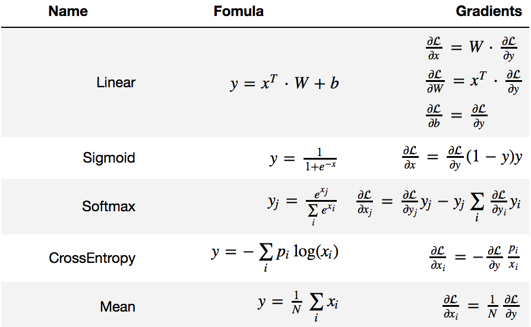

# Computation Graphs and Back Propagation

A minimal example of implementing back propagation for hand written digits classification task with `numpy`.

## How to use

To run the main program, please open this folder in a terminal and type

```bash
$ python learn_mnist_classification.py
```

It will

1). check the consistency of gradients obtained by back-propagation and numeric differentiation,

2). download MNIST dataset (hand written digits) from the internet,

3). build a classification network and learn to classify MNIST images.

## Building blocks of a simple classification networks

The computation graph of a simple classification network is


## Node definitions
Mathematical definitions of each node, code realizations are contained in `computation_graph.py`


